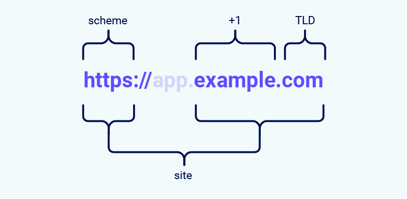

# BackendAuthentication

## Role-Based Access Control
Role-based access control (RBAC) refers to the idea of assigning permissions to users based on their role within an organization. It offers a simple, manageable approach to access management that is less prone to error than assigning permissions to users individually.
When using RBAC for Role Management, you analyze the needs of your users and group them into roles based on common responsibilities. You then assign one or more roles to each user and one or more permissions to each role. The user-role and role-permissions relationships make it simple to perform user assignments since users no longer need to be managed individually, but instead have privileges that conform to the permissions assigned to their role(s).


Reification means transforming something abstract (e.g. side effects, accessing fields, structure) into something "real" (values).

In functional effects, we reify by turning side-effects into values. For example, we might have a simple statement like;

```scala
println("Hello")
println("World")
In ZIO we reify this statement to a value like
val effect1 = F(println("Hello"))
val effect2 = F(println("World"))
```

Optics provide a way to access the fields of a case class and nested structures. There are three main types of optics:

- Lens: A lens is a way to access a field of a case class.
- Prism: A prism is a way to access a field of a nested structure or a collection.
- Traversal: A traversal is a way to access all fields of a case class, nested structures or collections.


JWT Authentication is a stateless authentication method well-suited for APIs and microservices architectures.


you might have app.example.com for the SPA and api.example.com for the API backend

Allow requests from app.example.com (or whatever your SPA's domain is) in the CORS configuration.

Ensure that your DNS records are correctly configured to point the subdomains (app.example.com and api.example.com) to the appropriate servers or hosting environments. This typically involves creating A or CNAME records in your DNS provider's dashboard.


`sudo -i -u postgres` to switch to this user
`psql` to connect to Postgres with user
`dscl . list /Users` to list all users on mac


X-CSRF-Token
HTTPOnly cookies are created and managed by the server and are not accessible by client-side JavaScript code

Since cookies work only in the browser, this strategy for storing JWT tokens in an HTTPOnly cookie only works for web applications. For mobile applications, we have to store JWT tokens differently and send it explicitly in the Authorization HTTP Request header for every API request.


To combat CSRF, we are going to use a technique called double submit verification.

 approach (called the "Cookie-to-header token" pattern) is to set a Cookie once per session and the have JavaScript read that cookie and set a custom HTTP header (often called X-CSRF-TOKEN or X-XSRF-TOKEN or just XSRF-TOKEN) with that value. Any requests will send both the header (set by Javascript) and the cookie (set by the browser as a standard HTTP header) and then the server can check that value in the X-CSRF-TOKEN header matches the value in the cookie header. The idea being that only JavaScript run on the same domain would have access to the cookie, so JavaScript from another domain couldn't set this header to the right value (assuming the page is not vulnerable to XSS that would give access to this cookie). Even fake links (e.g. in a phishing email) would not work either, as even though they would appear to come from the right domain, only the cookie will be set but not X-CSRF-TOKEN header


 By default, CORS requests do not send or set cookies. If you need to send cookies as part of the request, you will need to set the XHR .withCredentials property to True.


 In the context of SameSite cookie restrictions, a site is defined as the top-level domain (TLD), usually something like .com or .net, plus one additional level of the domain name. This is often referred to as the TLD+1.

When determining whether a request is same-site or not, the URL scheme is also taken into consideration. This means that a link from http://app.example.com to https://app.example.com is treated as cross-site by most browsers.

`http://app.example.com` and `http://api.example.com` are same site but cross origin
a cross-origin request can still be same-site, but not the other way around

https://example.com and https://example.com:8080, are same site but not same origin(no matched port)

https://app.example.com and https://intranet.example.com are same site but different origin( different domain name)


What's the difference between a site and an origin?
The difference between a site and an origin is their scope; a site encompasses multiple domain names, whereas an origin only includes one


Lax SameSite restrictions mean that browsers will send the cookie in cross-site requests, but only if both of the following conditions are met:

The request uses the GET method.

The request resulted from a top-level navigation by the user, such as clicking on a link.

This means that the cookie is not included in cross-site POST requests, for example. As POST requests are generally used to perform actions that modify data or state
[bypassing-samesite-restrictions](https://portswigger.net/web-security/csrf/bypassing-samesite-restrictions)


Network interface:
software or hardware between two pieces of equipment  or protocol layers in a computer network

Network interface controller:
a computer hardware component that connects a computer to a computer network. Also called Network Interface Card, network adapter,LAN adapter or physical network interface

NICs communicate using Internet Protocol(IP)
NICs are devices for both the :
1. Data Link Layer(Layer 2)
2. Physical Layer(Layer 1)


For example,  without the Azure Network Interface( virtual NIC) attached to a VM, the VM can't communicate

A VNIC connects the virtual machine or container to the virtual network, allowing it to communicate with other devices on the same network, both within the virtualized environment and outside of it


MACs are similar to digital signatures, but they do not have the advantage of asymmetric cryptography, because they require the same Private Key for "signing" a message and authenticating the message.

A certificate is a document that associates an identity to a given public key.  Certificates are signed by a third-party entity called a Certificate Authority (CA).

A Digital Certificate contains a public key and is itself signed by another entity. The signature of that entity can itself be verified by another entity and so on. We end up having what we call a certificate chain. Each top entity certifies the public key of the next entity. The most top-level entity is self-signed, which means that his public key is signed by his own private key.

The X.509 is the most used certificate format, and it is shipped either as binary format (DER) or text format (PEM).

The root certificate is the highest level certificate in the chain. it is self-signed and serves as the anchor of trust
- Add intermediate certificates
- add the server certificate ( end entity certificate) at the end of the chain

```bash
-----BEGIN CERTIFICATE-----
(Your Root Certificate)
-----END CERTIFICATE-----
-----BEGIN CERTIFICATE-----
(Your Intermediate Certificate 1)
-----END CERTIFICATE-----
-----BEGIN CERTIFICATE-----
(Your Intermediate Certificate 2)
-----END CERTIFICATE-----
-----BEGIN CERTIFICATE-----
(Your Server Certificate)
-----END CERTIFICATE-----
```

A CSR contains(includes) a signature corresponding to the public key in the CSR, signed by the private key
